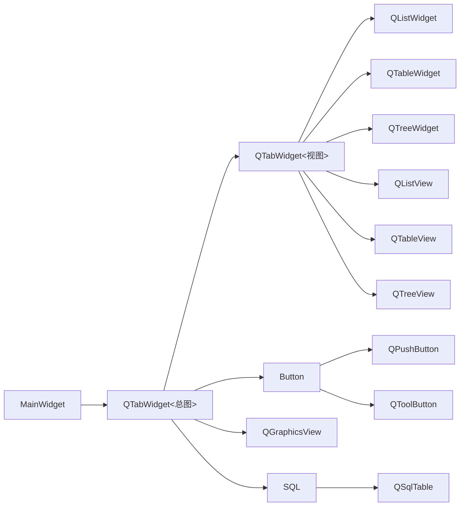
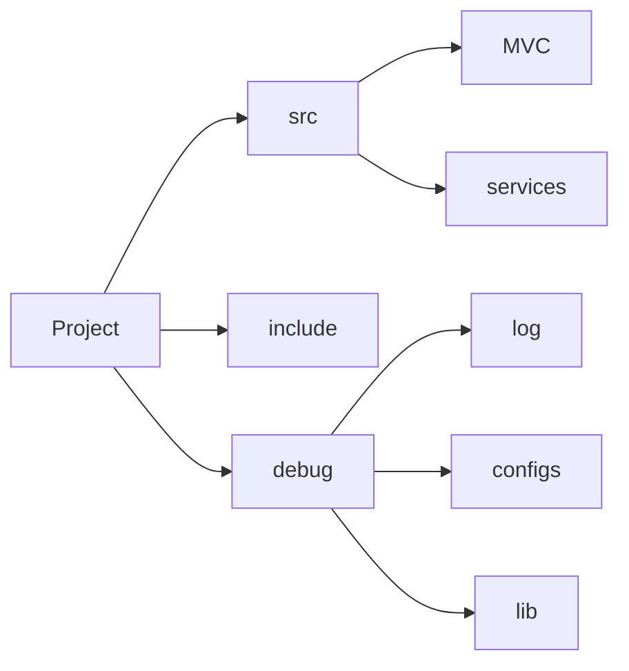

# QtWidgetManual
Qt原生控件的使用手册和Demo

> 窗口格式设计如下

```mermaid
graph LR
    A[MainWidget] --> Manager[QTabWidget<总图>]
    Manager --> MVC[QTabWidget<视图>]
    MVC --> D[QListWidget]
    MVC --> E[QTableWidget]
    MVC --> F[QTreeWidget]
    MVC --> G[QListView]
    MVC --> H[QTableView]
    MVC --> I[QTreeView]
    Manager --> J[Button]
    J --> L[QPushButton]
    J --> M[QToolButton]
    Manager --> N[QGraphicsView]
    Manager --> SQL[SQL]
    SQL --> SQLTable[QSqlTable]
```

> 文件层级

```mermaid
graph LR
    Project[Project] --> src[src]
    src[src]-->MVC[MVC]
    src[src]-->services[services]
    Project[Project] --> incluede[include]
    Project[Project] --> debug[debug]
    debug[debug] --> log[log]
    debug[debug] --> configs[configs]
    debug[debug] -->lib[lib]

```

